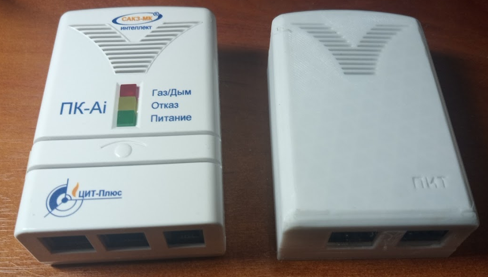
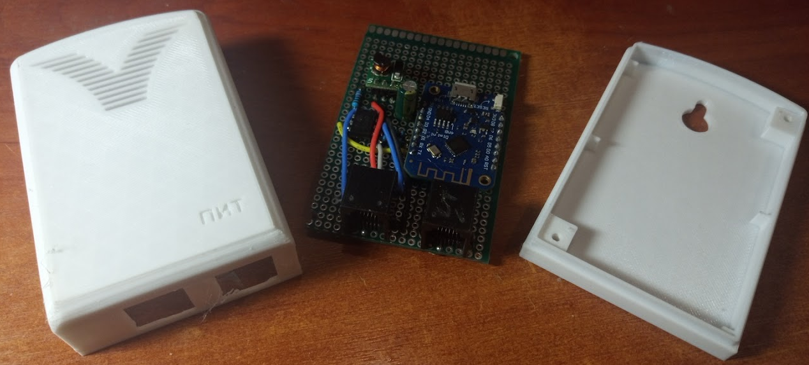

# Схема

В директории 3D содержится:
- bottom.stl - верх корпуса
- Top.stl - ни3 корпуса
- housing.stp - корпус в сборе

Корпус выполнен в стиле корпусов системы САКЗ

Корпус в сборе

Для сборки необходимы два шурупа 3-2.5х10

Внешний вид платы

