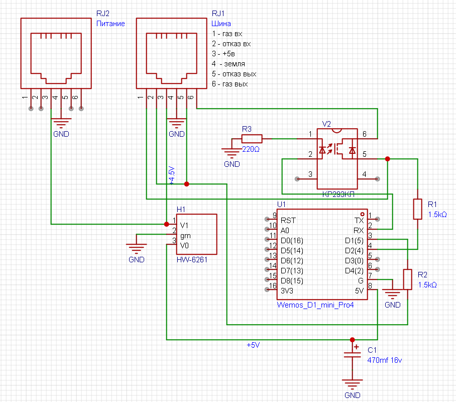
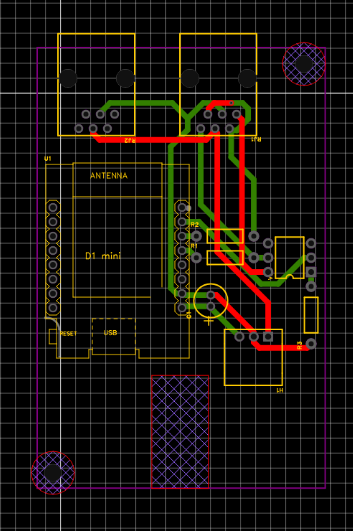
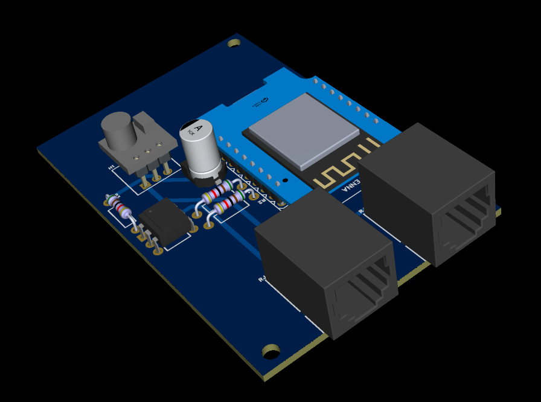
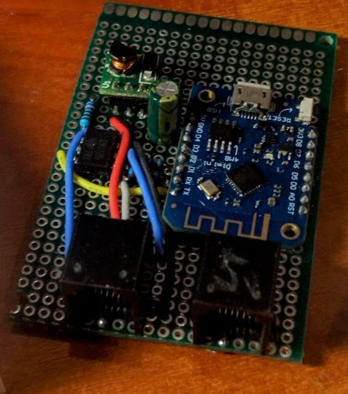

# Схема

В директории Schematic содержится:
- ProPrj_gas alarm_2025-01-07.epro -  для желающих сделать печатную плату данный для EasyEda

Принципиальная схема

__Размеры платы 51х78 мм__

Размещение на плате

Внешний вид платы

Единичную плату, наверное,  удобнее сделать на макете

